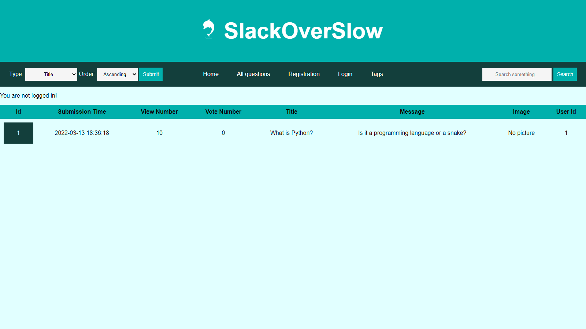

# SlackOverSlow

A crowdsourced Q&amp;A site, similar to Stack Overflow, using PostgreSQL and Flask.

Q&A sites attempts to answer questions asked by users.
Q&A sites is frequently integrated by large and specialist corporations and tends to be implemented as a community that allows users in similar fields to discuss questions and provide answers to common and specialist questions.

On these sites its users can be asked questions as well as provide or receive expert answers to them.
This kind of websites is particularly useful for responding to questions regarding specific industries.
Users may learn by regularly answering questions or exchanging views with other industry specialists using the website.

On crowdsourced or social Q&A sites, any user in the community can ask or answer questions.
Since a question can receive attention from many people unlike expert service, questioners are likely to benefit from the wisdom of crowds.



### Description
1. The application uses a PostgreSQL database.
2. There is a `/registration` and a `/login` page.
3. The `/list` page that displays all questions.
4. The main page displays the five latest submitted questions.
5. The question list can be sorted by title, submission time, message, number of views, and number of votes.
6. The `/question/<question_id>` page that displays a question and the answers for it.
7. The `/add-question` allows the user to add a question.
8. The `/question/<question_id>/delete` page deleting a question.
9. The user can upload an image for a question or answer.
10. The `/question/<question_id>/edit` page, allows the user to editing an existing question.
11. The `/answer/<answer_id>/delete` page, allow user to delete an answer.
12. Users can vote questions on the `/question/<question_id>/vote_up` and `/question/<question_id>/vote_down` endpoints.
13. User can vote ansers on the `/answer/<answer_id>/vote_up` and `/answer/<answer_id>/vote_down` endpoints.
14. The `/question/<question_id>/new-comment` page, allows the user to add comment to a question.
15. The `/answer/<answer_id>/new-comment` page, allows the user to add comment to an answer.
16. There is a search box on the main page for searching in questions and answers.
17. On the search results page, the searched phrase is highlighted.
18. The `/answer/<answer_id>/edit` page, the user can edit the answers.
19. The `/comment/<comment_id>/edit` page, the user can edit the comments.
20. User can delete comments on the `/comments/<comment_id>/delete` endpoint.
21. The `/question/<question_id>/new-tag` page allows the user to add a tag to a question.
22. User can delete a tag from a question on the `/question/<question_id>/tag/<tag_id>/delete` endpoint.
23. There is a `/users` page, where can list all the registered users with all their attributes.
24. There is a `/user/<user_id>` page, where can see all details and activities of a user.
25. The user who asked a question can change the accepted state of answers.
26. There is a reputation system to strengthen the community. Reputation is a rough measurement of how much the community trusts a user.

### Instruction:

To start:
```
python server.py
```

To install requirements:
```
pip install -r .\requirements.txt 
```
